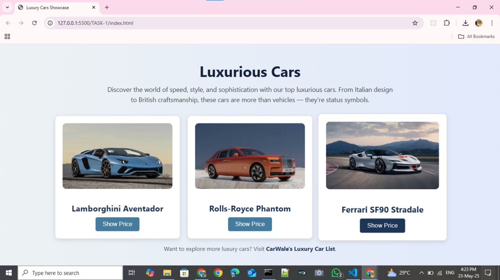

# Apexplanet

# 🚘 Luxurious Cars Showcase – Internship Task 1

This is a mini web project built as part of the **ApexPlanet Web Development Internship (HTML, CSS & JavaScript)**.  
It showcases **3 luxurious cars**, each with an image, name, and a button that reveals the price using basic JavaScript.

---

## 📌 Features

- ✅ Responsive card layout using **HTML & CSS**
- ✅ Styled buttons and images with hover effects
- ✅ **JavaScript alert** shows car price on button click
- ✅ Clean, minimal, and professional UI
- ✅ Includes an external link to explore more luxury cars

---

## 🛠️ Built With

- HTML5
- CSS3
- JavaScript (Vanilla)

---

## 🖼️ Preview

---
